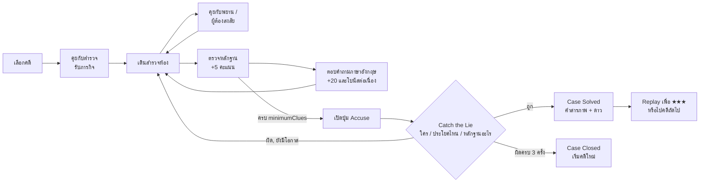
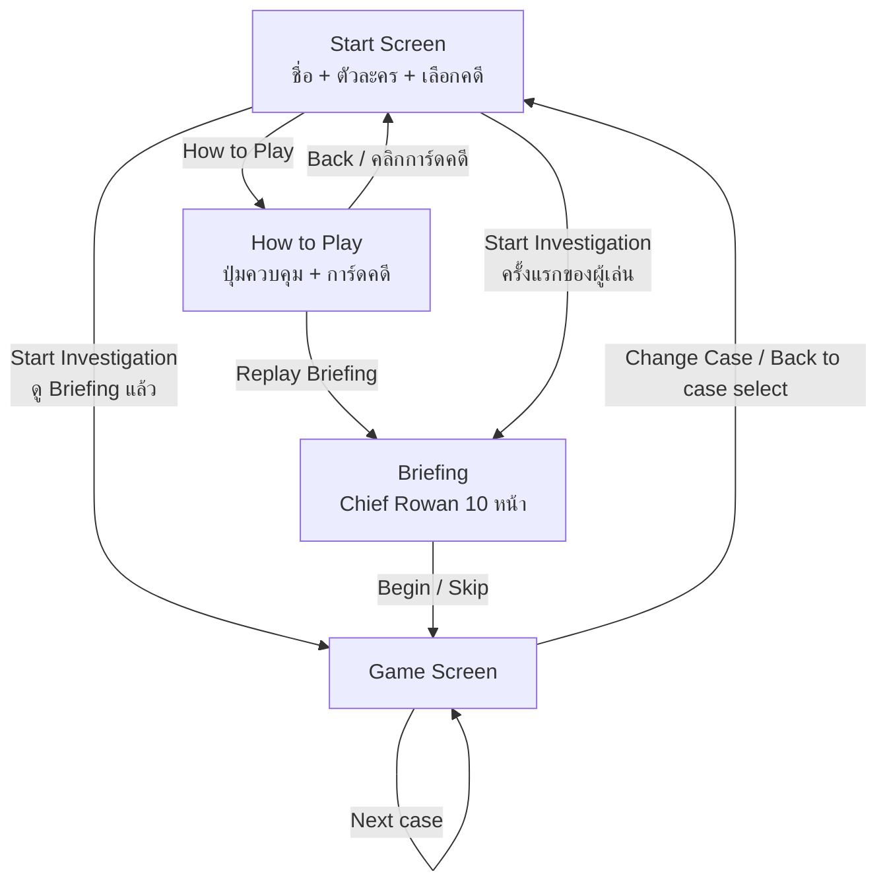

# Detective Word 2D — Game Design Document

| หัวข้อ | รายละเอียด |
|---|---|
| ชื่อเกม | **Detective Word 2D** |
| เวอร์ชันที่อ้างอิง | 7.2.0 (จาก `package.json`) |
| ประเภท | 2D top-down detective / educational simulation (เกมสืบสวนเพื่อฝึกภาษาอังกฤษ) |
| แพลตฟอร์ม | เว็บเบราว์เซอร์ (เดสก์ท็อปเป็นหลัก มีปุ่มสัมผัสสำหรับจอเล็ก) |
| เทคโนโลยี | Flask (ส่งไฟล์อย่างเดียว) + HTML / CSS / JavaScript ล้วน + Canvas 2D + Web Audio API |
| ผู้เล่นเป้าหมาย | นักเรียน/นักศึกษาไทยระดับ A2–B1 ที่ฝึกอ่านภาษาอังกฤษ เล่นในห้องเรียนบนเครื่องที่ใช้ร่วมกัน |
| ภาษา | เนื้อหาเกมเป็นภาษาอังกฤษ พร้อมซับไตเติลไทยที่เปิด/ปิดได้ |
| เวลาเล่นต่อคดี | ประมาณ 8–15 นาที (คดีทั้งหมด 10 คดี) |
| จำนวนผู้เล่น | 1 คน |

---

## สารบัญ

1. [แนวคิดของเกม](#1-แนวคิดของเกม)
2. [เป้าหมายการเรียนรู้](#2-เป้าหมายการเรียนรู้)
3. [Core Gameplay Loop](#3-core-gameplay-loop)
4. [ลำดับหน้าจอ (Game Flow)](#4-ลำดับหน้าจอ-game-flow)
5. [ระบบการเล่น (Mechanics)](#5-ระบบการเล่น-mechanics)
6. [คะแนน ดาว และเงื่อนไขแพ้/ชนะ](#6-คะแนน-ดาว-และเงื่อนไขแพ้ชนะ)
7. [ระบบช่วยเรียนภาษา](#7-ระบบช่วยเรียนภาษา)
8. [เนื้อหา: คดีทั้ง 10 คดี](#8-เนื้อหา-คดีทั้ง-10-คดี)
9. [ตัวละคร](#9-ตัวละคร)
10. [การออกแบบด่าน (Level Design)](#10-การออกแบบด่าน-level-design)
11. [ภาพและสไตล์ (Art Direction)](#11-ภาพและสไตล์-art-direction)
12. [เสียงและดนตรี](#12-เสียงและดนตรี)
13. [UI / HUD และการควบคุม](#13-ui--hud-และการควบคุม)
14. [สถาปัตยกรรมทางเทคนิค](#14-สถาปัตยกรรมทางเทคนิค)
15. [Data Schema ของคดี](#15-data-schema-ของคดี)
16. [การบันทึกข้อมูลและนโยบายห้องเรียน](#16-การบันทึกข้อมูลและนโยบายห้องเรียน)
17. [การทดสอบและตรวจสอบคุณภาพ](#17-การทดสอบและตรวจสอบคุณภาพ)
18. [ข้อสังเกตและงานที่ควรทำต่อ](#18-ข้อสังเกตและงานที่ควรทำต่อ)

---

## 1. แนวคิดของเกม

### 1.1 Elevator Pitch

> ผู้เล่นเป็นนักสืบมือใหม่ เดินสำรวจสถานที่เกิดเหตุแบบมุมมองจากด้านบน คุยกับพยานและผู้ต้องสงสัย อ่านหลักฐานที่เขียนเป็นภาษาอังกฤษ แล้ว **"จับโกหก"** ด้วยการเลือกผู้ต้องสงสัย ประโยคที่เป็นเท็จ และหลักฐานที่พิสูจน์ได้ ทุกคำที่ขีดเส้นใต้คลิกดูความหมายภาษาไทยได้ทันที

### 1.2 Design Pillars (หลักการออกแบบ)

| เสาหลัก | ความหมาย | ตัวอย่างในเกม |
|---|---|---|
| **อ่านเพื่อไขคดี** | ภาษาอังกฤษคือเครื่องมือไขคดี ไม่ใช่แบบฝึกหัดที่แปะเพิ่ม | คำตอบซ่อนอยู่ใน "เวลา" และ "สถานที่" ของหลักฐานกับคำให้การ ผู้เล่นต้องเข้าใจประโยคจึงจะจับผิดได้ |
| **ไม่มีทางหลง ไม่มีทางติด** | ผู้เล่นรู้เสมอว่าต้องทำอะไรต่อ และเดินไม่ติดผนัง | ป้ายเป้าหมายสีเหลือง, วงแหวนทอง, ลูกศรชี้ทาง, minimap, ประตูเปิดอัตโนมัติ, ระบบไถลมุม |
| **ช่วยเหลือได้ทันที** | ไม่ต้องออกจากเกมไปเปิดดิกชันนารี | คลิกคำ → ป๊อปอัปความหมายไทย, ตารางกริยา 3 ช่อง, ซับไตเติลไทยใต้ทุกบรรทัด |
| **ผิดได้ แต่ต้องคิด** | ความผิดพลาดมีราคา แต่ได้คำแนะนำกลับมาเสมอ | กล่าวหาผิดเสีย 1 ใน 3 โอกาส พร้อมบอก "เหตุผลที่ผิด" โดยไม่เฉลย |
| **พร้อมใช้ในห้องเรียน** | เปิดเว็บแล้วเล่นได้เลย ไม่ติดตั้ง ไม่ต้องล็อกอิน ไม่ทิ้งข้อมูลผู้เล่นไว้ในเครื่อง | รีเฟรชหน้า = ผู้เล่นคนใหม่, ปิดแคชเบราว์เซอร์ฝั่งเซิร์ฟเวอร์ |

### 1.3 Unique Selling Points

- ระบบ **Catch the Lie** สามขั้น (ใคร → ประโยคไหน → หลักฐานอะไร) บังคับให้ผู้เล่นเปรียบเทียบข้อความภาษาอังกฤษจริง ๆ แทนการเดา
- **ดิกชันนารีในเกมที่เข้าใจการผันคำ** — คลิก "logged", "went", "checked in", "sign-in" แล้วเจอคำหลักที่ถูกต้อง พร้อมคำอธิบายรูปคำเป็นภาษาไทย
- **ไม่มีไฟล์ภาพหรือเสียงเลย** ตัวละครวาดด้วยโค้ด ดนตรีแจ๊สสร้างแบบ procedural ทำให้เกมเบาและแก้ไขง่าย

---

## 2. เป้าหมายการเรียนรู้

หลังเล่นจบ ผู้เล่นควร:

1. **อ่านจับใจความ** ข้อความสั้นที่มีเวลา สถานที่ และลำดับเหตุการณ์ได้ถูกต้อง
2. **รู้คำศัพท์เฉพาะ 3 กลุ่ม**
   - Detective English — alibi, evidence, witness, confirm, contradict ฯลฯ
   - IT English — password, log in, backup, access, upload, firewall ฯลฯ
   - Workplace English — agenda, handover, check in, on leave, reply all, คำขอร้องอย่างสุภาพ ฯลฯ
3. **ใช้ Tense ในบริบทการเล่าเหตุการณ์** — ทุกคดีมีคำถาม tense 1 ข้อ เพราะ "คำให้การทุกอันคือเรื่องเล่าในอดีต" (จากบทพูดของ Chief Rowan)
4. **จำรูปกริยาอปกติ** ผ่านตารางช่อง 1 / ช่อง 2 / ช่อง 3 ในป๊อปอัป

### 2.1 จุด Grammar ในแต่ละคดี

| คดี | จุด Grammar | ตัวอย่างในคำถาม |
|---|---|---|
| 1 The Missing Laptop | Past continuous (การกระทำที่กำลังเกิดขึ้น ณ เวลาหนึ่งในอดีต) | At 4:10 p.m. I **was playing** football. |
| 2 The Vanishing Sculpture | Past perfect (เกิดก่อนอีกเหตุการณ์ในอดีต) | Priya **had finished** mopping… |
| 3 The Stolen Suitcase | คำถาม Past simple (Did + base verb) | **Did** you walk to the staff storage area? |
| 4 The Empty Tank | Present perfect + since | I **haven't used** my keycard since… |
| 5 The Leaked Password | Past simple กับเวลาที่ระบุชัด | Someone **posted** the password at 2:30 p.m. |
| 6 The Deleted Database | Past simple passive | The database **was deleted** at 11:48 p.m. |
| 7 The Hacked Website | Past simple passive vs. present perfect | The code **was typed in** at 3:09 a.m. |
| 8 The Missing Contract | be going to (แผนที่ตัดสินใจแล้ว) | We **are going to sign** at ten. |
| 9 The Night Shift | Past continuous + while / past simple | While Kevin **was helping** a guest… |
| 10 The Office Party | Reported speech (backshift) | He said that he **hadn't come** back. |

---

## 3. Core Gameplay Loop



**Micro loop (ระดับวินาที):** เดิน → เห็นป้าย `E` → กด E → อ่าน → คลิกคำที่ไม่รู้ → ปิดหน้าต่าง → เดินต่อ

**Macro loop (ระดับคดี):** สำรวจ → เก็บหลักฐาน → ตอบคำถาม → เปรียบเทียบคำให้การ → กล่าวหา → รับดาว → เล่นซ้ำ / คดีถัดไป

---

## 4. ลำดับหน้าจอ (Game Flow)



| หน้าจอ | องค์ประกอบ | หมายเหตุ |
|---|---|---|
| **Start** | ช่องชื่อ (สูงสุด 24 ตัวอักษร), เลือกตัวละคร 2 แบบ, dropdown คดีแบ่งกลุ่มตามหมวด, กล่อง preview (ระดับ, จำนวนเบาะแส, หัวข้อคำถาม, สถิติดีที่สุด), ปุ่มเสียง/ตั้งค่าเสียง | Dropdown แสดงดาวที่ดีที่สุดของแต่ละคดีต่อท้ายชื่อ |
| **How to Play** | ตารางปุ่มควบคุม, เป้าหมายนักสืบ 4 ข้อ, ปุ่มเล่น briefing ซ้ำ, การ์ดคดีทั้ง 10 | คลิกการ์ด → กลับหน้า Start พร้อมเลือกคดีนั้นไว้ |
| **Briefing** | ภาพ Chief Rowan (วาดด้วยโค้ด ปากขยับสลับหน้า), ข้อความ 10 หน้า, ปุ่ม Continue / Skip | แสดงครั้งเดียวต่อผู้เล่น (ต่อการโหลดหน้า) |
| **Game** | Top bar (สถิติ + ปุ่ม), Canvas 960×600, แผงคดีด้านขวา (minimap, objectives, การ์ดนักสืบ, ปุ่ม Accuse / Change Case) | Modal ทุกชนิดหยุดการเคลื่อนที่ |

---

## 5. ระบบการเล่น (Mechanics)

### 5.1 การเคลื่อนที่และการชน

| ค่า | ตัวเลข | ที่มา |
|---|---|---|
| รัศมีผู้เล่น | 9 px | `PLAYER_RADIUS` |
| ความเร็ว | 188 px/วินาที | `PLAYER_SPEED` |
| delta time สูงสุดต่อเฟรม | 50 ms | กันการทะลุผนังเมื่อเฟรมช้า |
| sub-step | ไม่เกิน 0.6 × รัศมีต่อก้าวย่อย | กันการกระโดดข้ามผนังบาง |

- เดิน 8 ทิศ (เวกเตอร์ถูก normalize แนวทแยงจึงไม่เร็วกว่า)
- ทิศที่หันหน้า (up/down/left/right) คำนวณจากแกนที่เคลื่อนมากกว่า ใช้เลือกท่าทาง sprite
- **การชน:** ผู้เล่นเป็นวงกลม ชนกับสี่เหลี่ยม 3 ชนิด — ขอบแผนที่, ผนัง, เฟอร์นิเจอร์
- **Furniture inset:** กล่องชนของเฟอร์นิเจอร์เล็กกว่าที่วาด 4–7 px (เช่น desk 5, computer 7) เดินเฉียดขอบโต๊ะได้ไม่สะดุด
- **การไถล:** ถ้าก้าวแนวทแยงชน ให้ลองทีละแกน ถ้ายังชนทั้งสองแกนให้ลองขยับด้านข้างทีละ 2 px สูงสุด 14 px (`CORNER_SLIDE_PX`) จึงลื่นผ่านมุมได้แทนที่จะหยุดค้าง

### 5.2 ประตูอัตโนมัติ

ประตูทุกบานเป็นบานเลื่อนสองบาน สร้างอัตโนมัติระหว่างห้องที่ติดกัน

| พารามิเตอร์ | ค่า | ผล |
|---|---|---|
| `DOOR_OPEN_DISTANCE` | 118 px | เริ่มเปิดก่อนผู้เล่นถึงประตู |
| `DOOR_CLOSE_DISTANCE` | 168 px | ปิดช้ากว่า (hysteresis) กันประตูกะพริบ |
| `DOOR_ANIMATION_SPEED` | 7.5 / วินาที | เปิดเต็มใน ~0.13 วินาที |
| `DOOR_PASSABLE_AT` | 0.55 | เปิดเกิน 55% บานประตูหยุดบังทาง |
| `DOOR_FUNNEL_RANGE` | 96 px | ระยะที่ระบบช่วยเล็งเข้าช่องประตู |
| `DOOR_FUNNEL_STRENGTH` | 4.2 | แรงดึงด้านข้างเข้ากลางช่อง |

- ประตูไม่ปิดใส่ผู้เล่นที่ยืนอยู่ในกรอบประตู
- ไฟสถานะบนประตู: **เขียว** = เปิด, **เหลืองอำพัน** = ปิด
- เสียง `doorOpen` / `doorClose` เล่นเมื่อเป้าหมายของประตูเปลี่ยน

### 5.3 การโต้ตอบ (Interaction)

- ทุกเฟรมหา NPC หรือหลักฐานที่ใกล้ที่สุดภายใน **66 px** (`INTERACT_DISTANCE`)
- แสดงป้าย `E  Talk to <ชื่อ>` หรือ `E  Inspect <ชื่อหลักฐาน>` เหนือ canvas
- กด **E** (หรือปุ่ม E บนจอสัมผัส) เปิดหน้าต่างที่ตรงกัน

### 5.4 บทสนทนา (Dialogue)

- NPC แต่ละคนมี 2–3 บรรทัด แสดงทีละบรรทัด ("Line 1 of 3") พร้อมหน้าตัวละครที่ปากเปิด
- ข้อความภาษาอังกฤษผ่าน `linkify()` คำที่อยู่ในดิกชันนารีจะขีดเส้นใต้ คลิกดูความหมายได้
- ซับไตเติลไทยแสดงใต้แต่ละบรรทัด (ถ้าเปิดอยู่)
- **คุยกับตำรวจครั้งแรก** = ทำ objective ข้อ 1 สำเร็จ
- บทสนทนาคุยซ้ำได้ไม่จำกัด (ไม่มีคะแนน)

### 5.5 หลักฐาน (Evidence)

- แสดงบนพื้นเป็นวงกลมเรืองแสงพร้อมไอคอน emoji วงแหวนสีทองเต้นเป็นจังหวะ
- ตรวจครั้งแรก: **+5 คะแนน**, เสียง `clue`, toast "New clue found", ไอคอนเปลี่ยนเป็น **สีเขียว** หยุดเต้น
- ทุกคดีมีหลักฐาน 5 ชิ้น ต้องเก็บอย่างน้อย `minimumClues` (3 หรือ 4) จึงกล่าวหาได้
- หลักฐานส่วนใหญ่ผูกกับคำถามภาษาอังกฤษ 1 ข้อ ปุ่มจะเป็น "Answer English question →" หรือ "Review answer →" ถ้าตอบแล้ว
- หลักฐานที่ไม่มีคำถามมีปุ่ม "Add to notebook"
- หลักฐานบางชิ้นเป็น **red herring** (เช่น Blue Fiber, Wet Net, Workshop Toolbox) ใส่ไว้ให้ผู้เล่นต้องคัดกรอง

### 5.6 คำถามภาษาอังกฤษ (English Challenge)

| องค์ประกอบ | รายละเอียด |
|---|---|
| หัวข้อ (`topic`) | `vocab` / `it` / `work` / `tense` — ป้ายแสดงมุมขวาบน |
| ตัวเลือก | 4 ข้อ (A–D) **สุ่มลำดับใหม่ทุกครั้งที่เริ่มคดี** ในไฟล์ข้อมูลข้อถูกอยู่ index 0 เสมอ |
| คำที่ถูกทดสอบ (`term`) | **ไม่ขีดเส้นใต้** ในคำถามข้อนั้น เพื่อไม่ให้ป๊อปอัปเฉลยคำตอบ |
| Hint | −3 คะแนน, รีเซ็ต streak, แสดงใน toast (ภาษาไทยด้วยถ้าเปิดซับ), ใช้ได้ครั้งเดียวต่อการเปิดหน้าต่าง |
| Answer later | ปิดหน้าต่างโดยไม่เสียอะไร |
| ตอบแล้ว | ล็อกคำตอบ แสดงข้อถูก (เขียว) / ข้อที่เลือกผิด (แดง) + คำอธิบาย (explain) |
| ตอบได้ครั้งเดียว | ไม่มีการแก้คำตอบ |

### 5.7 สมุดบันทึก (Notebook — ปุ่ม Q)

- 2 แท็บ: **Evidence x/5** และ **English x/N**
- หลักฐานที่ยังไม่เจอแสดงเป็น "🔒 Unknown Evidence" (บอกจำนวนแต่ไม่บอกเนื้อหา)
- คำถามที่ตอบแล้วแสดง ✅ / ❌ พร้อมคำอธิบาย
- มีปุ่ม 🚨 Accuse ด้านล่าง (ปิดใช้จนกว่าหลักฐานถึงขั้นต่ำ)

### 5.8 Catch the Lie — การกล่าวหา

เมื่อเก็บหลักฐานครบขั้นต่ำ ปุ่ม Accuse จะปลดล็อก (มีเสียง `sting`) และดนตรีเปลี่ยนเป็นเพลง **deduction** ขณะเปิดฟอร์ม

**ฟอร์ม 3 ขั้น:**

1. **Who is lying?** — เลือกผู้ต้องสงสัย (เฉพาะ role `Suspect`, ลำดับสุ่ม)
2. **Which statement is false?** — เลือกประโยคของผู้ต้องสงสัยคนนั้น (แสดงหลังเลือกขั้น 1)
3. **Which evidence proves it?** — เลือกจาก **หลักฐานที่เจอแล้วเท่านั้น** (ลำดับสุ่ม)

**การตัดสิน (`judge`)** — ตรวจตามลำดับ ขั้นหลังนับเฉพาะเมื่อขั้นก่อนถูก:

```
suspectOk = suspect == culpritId
lieOk     = suspectOk AND contradictions[statementIndex] มีอยู่
proofOk   = lieOk AND contradictions[statementIndex] มี clue ที่เลือก
ok        = proofOk
```

**Feedback เมื่อผิด** (ไม่เฉลย แต่บอกว่าผิดขั้นไหน):

| ผิดที่ | ข้อความ |
|---|---|
| ผู้ต้องสงสัย | "The evidence does not show that X lied. Look for a statement that clashes with a time or a place in your clues." |
| ประโยค | "X is hiding something — but that statement is not the lie. Read their other statement again." |
| หลักฐาน | "That statement is false, but this evidence does not prove it. Which clue shows a different time or place?" |

**ทางเลือกหลายทาง:** บางคดียอมรับหลายคำตอบ เช่น คดี 5 ประโยคแรกของ Oscar ถูกหักล้างด้วย Door Badge Log และประโยคที่สองถูกหักล้างด้วย Login Record ทั้งสองคู่ถือว่าถูก

**หลังไขคดีสำเร็จ:** หน้าต่าง CASE SOLVED แสดงตราประทับ, ดาว, "New personal best!", หน้าคนร้ายพร้อมคำสารภาพ, คำอธิบายเฉลย, รายการเกณฑ์ดาว และปุ่ม:
- **Replay for ★★★** (ถ้ายังไม่ได้ 3 ดาว)
- **Next case — new location** (ถ้าไม่ใช่คดีสุดท้าย)
- **Back to case select**

### 5.9 ระบบนำทาง (Guidance)

| ระบบ | พฤติกรรม |
|---|---|
| **Objective tip** (ป้ายเหลืองเหนือแผนที่) | บอกขั้นถัดไปเสมอ: หาตำรวจ → เก็บเบาะแส (x/y) → เปรียบเทียบคำให้การแล้วกล่าวหา (เหลือกี่โอกาส) → Case solved |
| **วงแหวนทอง + ลูกศร ⌄** | อยู่ที่ตำรวจก่อน แล้วย้ายไปหลักฐานที่ยังไม่เจอที่ **ใกล้ที่สุด** จนครบขั้นต่ำ |
| **ลูกศรขอบ** | ลูกศรสีทองรอบตัวผู้เล่นชี้ไปหาเป้าหมายเมื่ออยู่ไกลเกิน 150 px |
| **Minimap** | canvas แยกในแผงขวา: ห้องปัจจุบันไฮไลต์ขอบทอง, ประตู, เบาะแส (ทอง/เขียว), NPC (ตำรวจสีฟ้า), ผู้เล่นสีแดง |
| **Room banner** | ชื่อห้องขึ้นกลางจอ 1.9 วินาทีเมื่อเข้าห้องใหม่ |
| **Objectives list** | 3 ข้อ ขีดฆ่าเมื่อทำสำเร็จ |

ระบบเหล่านี้ **ช่วยหาทาง แต่ไม่เปลี่ยนกติกา** หลังเก็บหลักฐานครบขั้นต่ำ เครื่องหมายนำทางจะหายไป ผู้เล่นต้องตัดสินใจเองว่าจะเก็บหลักฐานที่เหลือหรือไม่

---

## 6. คะแนน ดาว และเงื่อนไขแพ้/ชนะ

### 6.1 ตารางคะแนน (`SCORE` ใน `core.js`)

| เหตุการณ์ | คะแนน |
|---|---|
| เจอหลักฐานครั้งแรก | +5 |
| ตอบคำถามถูก | +20 |
| โบนัส streak (ตอบถูกติดกัน) | +5 × (streak − 1) สูงสุด +15 → ข้อที่ 2 = 25, ข้อที่ 3 = 30, ข้อที่ 4 ขึ้นไป = 35 |
| ตอบคำถามผิด | −5 (รีเซ็ต streak) |
| ใช้ Hint | −3 (รีเซ็ต streak) |
| ไขคดีสำเร็จ | +50 |
| กล่าวหาผิด | −10 และเสีย 1 โอกาส |

คะแนนจากบทลงโทษจะไม่ติดลบ (ต่ำสุด 0)

### 6.2 คะแนนสูงสุดต่อคดี

| หมวด | หลักฐาน | คำถาม | ไขคดี | **รวม** |
|---|---|---|---|---|
| Detective (4 คำถาม) | 5 × 5 = 25 | 20 + 25 + 30 + 35 = 110 | 50 | **185** |
| IT / Workplace (3 คำถาม) | 5 × 5 = 25 | 20 + 25 + 30 = 75 | 50 | **150** |

### 6.3 ดาว (★ สูงสุด 3 ดวงต่อคดี)

| ดาว | เงื่อนไข |
|---|---|
| ★ | ไขคดีสำเร็จ |
| ★ | ไม่กล่าวหาผิดเลย (โอกาสยังเต็ม 3) |
| ★ | ตอบคำถามภาษาอังกฤษ **ทุกข้อ** ถูก และ **ไม่ใช้ hint เลย** |

- ดาวคำนวณ ณ ตอนไขคดีสำเร็จ → ผู้เล่นต้องตอบคำถามให้ครบ **ก่อน** กล่าวหา จึงจะได้ดาวดวงที่ 3 ซึ่งหมายความว่าต้องเปิดหลักฐานที่มีคำถามให้ครบทุกชิ้น (ตัวตรวจข้อมูลยืนยันว่าทุกคำถามผูกกับหลักฐาน ดาว 3 ดวงจึงทำได้เสมอ)
- **Personal best** เก็บต่อคดี: ดาวมากกว่าชนะก่อน ถ้าดาวเท่ากันดูคะแนน

### 6.4 เงื่อนไขแพ้

- กล่าวหาผิด **3 ครั้ง** (`MAX_CHANCES = 3`) → หน้าต่าง **CASE CLOSED** "Chief Rowan has taken you off the case." ให้เลือก Restart this case หรือ Back to case select
- ไม่มีจับเวลา ไม่มีการตายในเกม

---

## 7. ระบบช่วยเรียนภาษา

### 7.1 Click-to-Translate (`dictionary.js`)

ข้อความภาษาอังกฤษทุกจุดที่ผู้เล่นอ่าน (บทพูด, หลักฐาน, คำถาม, คำอธิบาย, ฟอร์มกล่าวหา, คำสารภาพ, briefing) ผ่าน `linkify()` ซึ่ง:

1. แยกข้อความเป็นคำกับช่องว่าง แล้ว escape ทีละชิ้น (กัน XSS และกันลิงก์ตัดกลาง HTML entity)
2. ลองจับวลียาวที่สุดก่อน: **3 คำ → 2 คำ → 1 คำ** (เช่น "out of office", "log in")
3. คำเดี่ยวสั้นกว่า 3 ตัวอักษรไม่ขีดเส้นใต้
4. ขีดเส้นใต้คำที่เจอใน `DW_VOCAB` ด้วย `<span class="dw-word">`

**การจับรูปคำ (`wordVariants`)** — เก็บเฉพาะรูปพื้นฐานในดิกชันนารี แต่จับรูปผันได้:

| กฎ | ตัวอย่าง |
|---|---|
| irregular | went → go, gone → go, stolen → steal |
| -ies / -ied | copies → copy, copied → copy |
| -es / -s | witnesses → witness, clues → clue |
| -ed / -d | confirmed → confirm, arrived → arrive |
| พยัญชนะซ้ำ | logged → log, dripping → drip |
| -ing | checking → check, leaving → leave |
| วลี (ผันคำแรก) | followed up → follow up, checked in → check in |
| ขีดกลาง = ช่องว่าง | sign-in → sign in |

### 7.2 ป๊อปอัปคำศัพท์

แสดงเหนือคำ (หรือใต้คำถ้าไม่มีที่) กว้าง 264 px ประกอบด้วย:

- คำ + ชนิดของคำ (n., v., adj., phr. v. …)
- ความหมายภาษาไทย
- **ตารางกริยา 3 ช่อง** (เฉพาะกริยาอปกติ) — ช่อง 1 base / ช่อง 2 past simple / ช่อง 3 past participle โดยไฮไลต์ช่องที่ตรงกับคำที่คลิก
- **คำอธิบายรูปคำภาษาไทย** เช่น `sits = sit + -s · กริยาช่อง 1 ที่ใช้กับ he / she / it (present simple)` หรือ `came = กริยาช่อง 2 (past simple) ของ come · ใช้เล่าเหตุการณ์ที่จบแล้วในอดีต`
- ประโยคตัวอย่างภาษาอังกฤษ

### 7.3 คลังคำศัพท์ (`data/vocab.js`)

- **405 คำ/วลี** + **41 กริยาอปกติ** (ผลจาก `tools/validate_data.py`)
- แบ่งหมวด: investigation, objects, places, people & roles, time, verbs, adjectives & adverbs, case-specific, base verbs for tense practice, IT English (คดี 5–7), Workplace English (คดี 8–10)
- คำที่คลิกได้ต่อคดี 42–59 คำ

### 7.4 ซับไตเติลไทย (`thai.js`)

- แสดงเป็นบรรทัดไทยเล็ก จาง ใต้ข้อความอังกฤษ: บทพูด, หลักฐาน, คำถาม/ตัวเลือก/คำอธิบาย/hint, ตัวเลือกในฟอร์มกล่าวหา, คำสารภาพ, เฉลย
- เปิด/ปิดด้วยปุ่ม **ไทย ON/OFF** หรือปุ่ม **T** — ปิดเพื่อทดสอบตัวเอง
- เริ่มต้น **เปิด** ทุกครั้งสำหรับผู้เล่นใหม่
- คำแปลของตัวเลือกเก็บตามลำดับต้นฉบับ แม้ตัวเลือกจะถูกสุ่มบนจอ คำแปลก็ยังตรงกัน
- ถ้าคำแปลขาดหาย จะไม่แสดงอะไร (ไม่ทำให้หน้าต่างพัง)

---

## 8. เนื้อหา: คดีทั้ง 10 คดี

ลำดับการเล่น = ลำดับใน dropdown (จัดกลุ่มตามหมวด) ปุ่ม "Next case" เดินตามลำดับนี้

### 8.1 ตารางสรุป

| # | คดี | หมวด | ระดับ | สถานที่ | ห้อง | หลักฐานขั้นต่ำ | คำถาม | ธีมเพลง |
|---|---|---|---|---|---|---|---|---|
| 1 | The Missing Laptop | 🕵️ Detective | Beginner | Narin School | 6 | 3 | 4 | school |
| 2 | The Vanishing Sculpture | 🕵️ Detective | Intermediate | Bayview Museum | 5 | 4 | 4 | museum |
| 3 | The Stolen Suitcase | 🕵️ Detective | Intermediate | Riverside Station | 6 | 4 | 4 | station |
| 4 | The Empty Tank | 🕵️ Detective | Advanced | Coral Bay Aquarium | 4 | 4 | 4 | aquarium |
| 5 | The Leaked Password | 💻 IT | Beginner | Pixel Lab Office | 6 | 3 | 3 | school |
| 6 | The Deleted Database | 💻 IT | Intermediate | Cloudline Data Center | 6 | 4 | 3 | aquarium |
| 7 | The Hacked Website | 💻 IT | Advanced | Brightwave Online Shop | 5 | 4 | 3 | station |
| 8 | The Missing Contract | 💼 Workplace | Beginner | Harbor & Co. Office | 6 | 3 | 3 | school |
| 9 | The Night Shift | 💼 Workplace | Intermediate | Grand Palm Hotel | 5 | 4 | 3 | museum |
| 10 | The Office Party | 💼 Workplace | Advanced | Summit Tower, 12th Floor | 7 | 4 | 3 | station |

ทุกคดีมี NPC 5 คน (คดี 9 มี 6) = ตำรวจ 1 + พยาน 1–2 + ผู้ต้องสงสัย 3 และมีหลักฐาน 5 ชิ้น

### 8.2 รายละเอียดคดี (มีเฉลย)

> ⚠️ ส่วนนี้มีเฉลยทุกคดี สำหรับครูและทีมพัฒนา

#### คดี 1 — The Missing Laptop · Narin School · Beginner
- **เหตุ:** แล็ปท็อปของครูหายจากห้อง 204 หลังสี่โมงเย็น
- **ห้อง:** Staff Office, Classroom 204, Library, School Yard, Hallway, Equipment Room
- **พยาน:** Officer Reyes (ตำรวจ), Ms. Anna (ครู)
- **ผู้ต้องสงสัย:** Tom, Jenny, **Mike** (คนร้าย)
- **คำโกหก:** "I went straight home right after school ended at four." / "I never even walked past Classroom 204 today."
- **หลักฐานชี้ขาด:** Security Camera — Mike เข้าห้อง 204 คนเดียวตอน 4:15 p.m. (หักล้างได้ทั้ง 2 ประโยค)
- **Alibi ของคนอื่น:** Library Sign-in Sheet (Jenny), Team Photo (Tom) · **Red herring:** Blue Fiber

#### คดี 2 — The Vanishing Sculpture · Bayview Museum · Intermediate
- **เหตุ:** รูปปั้นสัมฤทธิ์หายตอนกลางคืน กล้องหลักถูกปิด 11 นาที
- **ห้อง:** Entrance Lobby, Main Gallery, Security Office, Sculpture Hall, Workshop
- **พยาน:** Officer Diaz, Ms. Wren (ภัณฑารักษ์)
- **ผู้ต้องสงสัย:** **Victor** (ยามกลางคืน — คนร้าย), Priya (แม่บ้าน), Noah (ช่าง)
- **คำโกหก:** "…stayed at the front desk all night and never went near the Sculpture Hall."
- **หลักฐานชี้ขาด:** White Cotton Glove หรือ Staff Sign-in Sheet (Victor อยู่ในห้องคนเดียว 12:02–12:13 a.m.) · ใช้ร่วมกับ Camera Control Log (ปิด 12:03–12:14)
- **Red herring:** Workshop Toolbox

#### คดี 3 — The Stolen Suitcase · Riverside Station · Intermediate
- **เหตุ:** กระเป๋าเดินทางหายจาก Platform 2 ช่วงเย็นที่คนแน่น
- **ห้อง:** Ticket Hall, Waiting Area, Platform 1, Platform 2, Lost & Found, Staff Storage
- **พยาน:** Officer Blake, Sara (คนขายอาหาร)
- **ผู้ต้องสงสัย:** **Harlan** (คนร้าย), Mira, Conductor Lee
- **คำโกหก:** "I stayed on Platform 1 the entire time…" / "I never crossed over to Platform 2 at all."
- **หลักฐานชี้ขาด:** Platform Footage — ชายเสื้อโค้ทเทาข้ามไป Platform 2 เวลา 6:42 p.m. หน้าตรงกับ Harlan
- **Alibi ของคนอื่น:** Used Ticket Stub (Mira ขึ้นรถไฟ 6:30)

#### คดี 4 — The Empty Tank · Coral Bay Aquarium · Advanced
- **เหตุ:** ปลาน้ำลึกหายากหายจาก Tank Four แม่กุญแจไม่มีร่องรอยงัด
- **ห้อง:** Reception, Main Tank Hall, Feeding Room, Filtration Room (แผนที่ 1 แถว 4 ห้อง)
- **พยาน:** Officer Nash, Elena (ผู้ดูแลสัตว์)
- **ผู้ต้องสงสัย:** **Dorian** (คนร้าย), Mr. Voss (นักสะสม), Hana (อาสาสมัคร)
- **คำโกหก:** "I haven't used my staff keycard since I clocked out." (เฉพาะประโยคที่ 2)
- **หลักฐานชี้ขาด:** Electronic Lock Record — คีย์การ์ดของ Dorian เปิดประตูเวลา 9:47 p.m. ตรงกับบันทึกการให้อาหารที่ไม่มีลายเซ็น
- **ความยาก:** ประโยคแรก ("My shift ended at six…") เป็นความจริง ผู้เล่นต้องเลือกประโยคให้ถูก · **Red herring:** Wet Net

#### คดี 5 — The Leaked Password · Pixel Lab Office · Beginner (IT)
- **เหตุ:** รหัสผ่าน admin ถูกโพสต์บนฟอรัมสาธารณะ
- **ห้อง:** Open Office, Meeting Room, Manager's Office, Reception, Kitchen, Print Corner
- **พยาน:** Officer Park, Ms. Kim (IT Manager)
- **ผู้ต้องสงสัย:** **Oscar** (คนร้าย), Ben, Lina
- **คำโกหก 2 ประโยค หลักฐานคนละชิ้น:**
  - "I stayed in the meeting room with the design team all afternoon." ← **Door Badge Log** (ออกจากห้อง 2:21 กลับ 2:37)
  - "I never logged in to any computer after lunch." ← **Login Record** (บัญชีเขาบน PC-07 2:25–2:34; โพสต์เกิด 2:30)

#### คดี 6 — The Deleted Database · Cloudline Data Center · Intermediate (IT)
- **เหตุ:** ฐานข้อมูลลูกค้าถูกลบก่อนเที่ยงคืน backup ถูกปิด
- **ห้อง:** Lobby, Control Room, Director's Office, Break Room, Server Hall, Cooling Room
- **พยาน:** Officer Quinn, Mr. Alvarez (IT Director)
- **ผู้ต้องสงสัย:** **Greg** (อดีตพนักงาน — คนร้าย), Raj, Mei
- **คำโกหก:** "I haven't connected to the company system since my last day."
- **หลักฐานชี้ขาด:** VPN Record (บัญชี g.hart เชื่อมต่อ 11:40–11:52 p.m.) หรือ Audit Log (DELETE DATABASE 11:48 p.m. จาก g.hart)

#### คดี 7 — The Hacked Website · Brightwave Online Shop · Advanced (IT)
- **เหตุ:** หน้าแรกถูกแทนด้วยหน้าลดราคาปลอมที่ขโมยเลขบัตร เวลา 3:10 a.m.
- **ห้อง:** Reception, Marketing, Break Area, Developer Room, Server Closet
- **พยาน:** Officer Grant, Ms. Osei (เจ้าของร้าน)
- **ผู้ต้องสงสัย:** **Nina** (คนร้าย), Tariq, Carlos
- **คำโกหก:** "My phone was switched off all night…" / "I didn't log in to the shop system at all after midnight."
- **หลักฐานชี้ขาด:** Two-Factor Code (ส่งไปโทรศัพท์ 3:08 พิมพ์ถูก 3:09)
- **จุดออกแบบ:** Upload Log แสดงแค่ *บัญชี* ของ Nina จึงไม่ใช่หลักฐานพอ — รหัส 2FA บนโทรศัพท์ต่างหากที่พิสูจน์ว่า *ตัว Nina* ตื่นอยู่และล็อกอินเอง

#### คดี 8 — The Missing Contract · Harbor & Co. Office · Beginner (Workplace)
- **เหตุ:** สัญญาลูกค้าที่เซ็นแล้วหายจากห้องประชุมก่อนประชุม 10 โมง
- **ห้อง:** Reception, Open Office, Manager's Office, Café Corner, Meeting Room, Copy Room
- **พยาน:** Officer Ruiz, Ms. Grace (Office Manager)
- **ผู้ต้องสงสัย:** **Henry** (คนร้าย), Daniel, Amy
- **คำโกหก:** "I was out of office at the dentist until eleven…" / "I haven't touched the Bluefin contract all week."
- **หลักฐานชี้ขาด:** Copy Room Camera — Henry ที่เครื่องถ่ายเอกสาร 9:40 a.m. ถือแฟ้ม BLUEFIN

#### คดี 9 — The Night Shift · Grand Palm Hotel · Intermediate (Workplace)
- **เหตุ:** เงินมัดจำของแขกหายจากลิ้นชักเคาน์เตอร์ตอนกลางคืน
- **ห้อง:** Front Desk, Manager's Office, Staff Lockers, Lobby, Luggage Room
- **พยาน:** Officer Lane, Mr. Ahmed (ผู้จัดการ), Mr. Dale (แขก) — คดีเดียวที่มีพยาน 2 คน
- **ผู้ต้องสงสัย:** **Rosa** (คนร้าย), Kevin, Sunny
- **คำโกหก 2 ประโยค หลักฐานคนละชิ้น:**
  - "My shift ended at eleven, and I went straight home after the handover." ← **Staff Clock-out Record** (1:20 a.m.)
  - "I haven't been near the front desk since eleven o'clock last night." ← **Black Jacket** (ซอง Room 512 ในกระเป๋า)

#### คดี 10 — The Office Party · Summit Tower 12F · Advanced (Workplace)
- **เหตุ:** บัตรของขวัญ 30,000 บาทหายจากลิ้นชัก HR ระหว่างงานเลี้ยงปีใหม่
- **ห้อง:** Lift Lobby, Open Office, Accounting, HR Office, Lounge, Stage, IT Cupboard (7 ห้อง มากที่สุด)
- **พยาน:** Officer Moss, Ms. Tan (HR Manager)
- **ผู้ต้องสงสัย:** **Jake** (คนร้าย), Olivia, Marcus
- **คำโกหก 2 ประโยค หลักฐานคนละชิ้น:**
  - "I was on leave all afternoon, and I didn't come back to the office on Friday." ← **Lift Log** (ขึ้นชั้น 12 เวลา 5:40 p.m.)
  - "I had no idea where Ms. Tan kept the gift card." ← **Reply-All Email** (Jake ตอบอีเมลที่บอกว่าอยู่ลิ้นชักบนสุด)

### 8.3 Difficulty Curve

| ระดับ | ลักษณะ |
|---|---|
| **Beginner** | หลักฐานขั้นต่ำ 3, หลักฐานชี้ขาดตรงไปตรงมา (กล้อง/บันทึก), คำโกหกทั้ง 2 ประโยคมักหักล้างได้ |
| **Intermediate** | หลักฐานขั้นต่ำ 4, ต้องโยงเวลา 2 แหล่ง (เช่น sign-in + camera log), มีพยานให้ข้อมูลอ้อม |
| **Advanced** | มีประโยคจริงปนประโยคเท็จ, ต้องแยก "บัญชี" กับ "ตัวคน", ห้องมากขึ้น, คำถาม grammar ซับซ้อนขึ้น (reported speech, passive vs. perfect) |

---

## 9. ตัวละคร

### 9.1 ตัวละครผู้เล่น

| ID | ชื่อ | ลักษณะ |
|---|---|---|
| `blue` | Rookie Blue | ผมตั้ง (spiky), แว่นตา, เสื้อน้ำเงินเข้ม, ตราตำรวจ |
| `red` | Rookie Red | ผมบ็อบ, เสื้อแดงไวน์, ตราตำรวจ |

ชื่อที่ผู้เล่นพิมพ์แสดงบนป้ายชื่อแดงเหนือตัวละครและในการ์ดนักสืบ ("Rookie Investigator")

### 9.2 Chief Rowan

หัวหน้าหน่วยสืบสวนรุ่นเยาว์ — ผู้บรรยาย briefing 10 หน้า (แนะนำบทบาท, หมวดคดี, การเดิน, ปุ่ม E, หลักฐาน, คลิกคำ, Notebook, การกล่าวหา, คำอวยพร) และเป็นคน "ถอดผู้เล่นออกจากคดี" เมื่อผิดครบ 3 ครั้ง

### 9.3 NPC ในคดี

| บทบาท (`role`) | จำนวนต่อคดี | หน้าที่ |
|---|---|---|
| Police Officer | 1 | เล่าเหตุ บอกให้หาหลักฐานกี่ชิ้น — objective แรก (สีฟ้าบน minimap) |
| พยาน (Teacher, Curator, IT Manager, Hotel Guest ฯลฯ) | 1–2 | ให้ข้อมูลเวลา/สถานที่ ยืนยันหรือชี้นำ |
| Suspect | 3 | มีคำให้การ 2 ประโยค 1 คนคือคนร้าย มีประโยคเท็จอย่างน้อย 1 ประโยค |

**ระบบรูปลักษณ์ (look):** skin, hair, hairStyle (9 แบบ: short, bob, pony, long, bun, spiky, curly, cap, fedora), top, bottom, shoes, eye และส่วนเสริม accent, badge, glasses, collar · ตัวตรวจข้อมูลห้ามชื่อ NPC ซ้ำข้ามคดี และห้ามรูปลักษณ์ซ้ำกัน

---

## 10. การออกแบบด่าน (Level Design)

### 10.1 Grid Map Builder (`engine/mapkit.js`)

แต่ละแผนที่ประกาศเป็นตาราง `rows × cols` (ขนาดเป็นพิกเซล) แล้ว `gridMap()` จะ:

1. คำนวณสี่เหลี่ยมของแต่ละห้อง (เซลล์ `null` = ไม่มีห้อง)
2. สร้าง **ผนังรอบนอกทึบ** หนา `margin` (24 px)
3. สร้าง **ผนังระหว่างห้องที่ติดกันพร้อมประตูกลางผนัง** กว้าง 76 px (ช่องเดินโล่ง ~58 px สำหรับผู้เล่นกว้าง 18 px)
4. สร้างผนังทึบระหว่างห้องกับพื้นที่ว่าง

ผลคือ **ทุกห้องเข้าถึงได้เสมอ** และไม่มีผนังปิดทางโดยไม่ตั้งใจ (ปัญหาหลักของแผนที่เวอร์ชันก่อน)

### 10.2 ขนาดแผนที่

ทุกแผนที่มีเนื้อที่ห้องรวม 912 × 552 px + margin = **960 × 600 px** เท่ากับ canvas พอดี จึง **ไม่มีกล้องเลื่อน** มองเห็นทั้งแผนที่ตลอด

| รูปแบบตาราง | คดี |
|---|---|
| 2 แถว × 3 คอลัมน์ | 1, 2, 5, 6, 7, 8, 9 |
| 3 แถว × 2 คอลัมน์ | 3 |
| 1 แถว × 4 คอลัมน์ | 4 |
| 2 แถว × 4 คอลัมน์ | 10 |

### 10.3 เฟอร์นิเจอร์

ชนิดที่วาดได้: `desk`, `counter`, `shelf`, `bench`, `gym_bench`, `locker`, `crate`, `computer`, `printer`, `server` (ชนิดอื่นวาดเป็นกล่องเทา) · เฟอร์นิเจอร์ยาวถูกแบ่งเป็นท่อนเพื่อเว้นทางเดินหน้าประตู (เห็นได้ในคดี 3 และ 4)

### 10.4 กฎการวางวัตถุ (บังคับโดย validator)

- จุดเกิดผู้เล่น, NPC และหลักฐานต้องอยู่ในห้อง ไม่ทับผนังหรือเฟอร์นิเจอร์
- ทุก NPC และหลักฐานต้อง **เดินไปถึงได้** จากจุดเกิด (ตรวจด้วย walkability grid ทุก 4 px)
- เฟอร์นิเจอร์ห้ามทับกันและห้ามบังประตู
- ทุกสี่เหลี่ยมต้องอยู่ในขอบแผนที่

### 10.5 แนวทางวางเนื้อหา

- ตำรวจอยู่ใกล้จุดเกิด (objective แรกสั้น)
- หลักฐานชี้ขาดมักอยู่ห้องไกลหรือห้องด้านใน (กล้อง, server, copy room) ผู้เล่นต้องสำรวจจริง
- พยาน alibi ของผู้บริสุทธิ์วางใกล้ตัวผู้ต้องสงสัยคนนั้น

---

## 11. ภาพและสไตล์ (Art Direction)

### 11.1 โทนโดยรวม

**Noir คลาสสิกผสมกระดาษแฟ้มคดี** — พื้นหลังน้ำเงินกรมท่าเข้ม, การ์ดสีกระดาษเก่า, แดงหลักฐาน, ทองเหรียญตรา

| Token | สี | การใช้ |
|---|---|---|
| `--navy-deep` | `#0b132b` | พื้นหลังหลัก |
| `--navy-case` | `#17233d` | แผง / top bar |
| `--navy-mid` | `#223258` | องค์ประกอบรอง |
| `--paper` | `#f3ecda` | การ์ด / modal |
| `--paper-dim` | `#e6ddc4` | กระดาษเงา |
| `--ink` | `#1c1a14` | ตัวอักษรบนกระดาษ |
| `--evidence-red` | `#b23a48` | ปุ่ม Accuse, ป้ายชื่อผู้เล่น |
| `--solved-gold` | `#d4a72c` | ดาว, ตรา, ตัวบ่งชี้เป้าหมาย |
| `--ok-green` | `#4c9a6a` | สถานะถูก / เจอแล้ว |

### 11.2 ฟอนต์

| ฟอนต์ | ใช้กับ |
|---|---|
| Yeseva One | หัวเรื่อง, room banner |
| Vollkorn | เนื้อหาที่ต้องอ่าน |
| Oswald | UI, ตัวเลข, ป้ายชื่อ |
| Taviraj | ภาษาไทยทุกจุด (fallback ในทุก stack) |

### 11.3 Sprite

- **Chibi pixel art วาดด้วยสี่เหลี่ยมบน canvas ทั้งหมด** (`engine/sprites.js`) ไม่มีไฟล์ภาพ
- Unit grid: รองเท้า 0–3, ขา 3–9, ลำตัว/แขน 9–17, หัว 17–30, ผม 30+
- 4 ทิศ, ท่า idle / walk (4 เฟรม) / talk (ปากเปิด)
- เงา/ไฮไลต์คำนวณจากสีหลักด้วยฟังก์ชัน `darker()` / `lighter()`
- ฉาก: พื้นแต่ละห้องคนละสีพาสเทล + ตาราง 32 px จาง ๆ, ผนังน้ำเงินเข้มขอบบนสว่าง, ประตูไม้สีน้ำตาลมีแถบมือจับ

### 11.4 Visual Feedback

| เหตุการณ์ | Feedback |
|---|---|
| หลักฐานยังไม่เจอ | วงกลมเหลืองโปร่ง + วงแหวนทองเต้น |
| หลักฐานเจอแล้ว | วงกลมเขียว หยุดเต้น |
| เป้าหมายถัดไป | วงรีทองบนพื้น + chevron ลอยขึ้นลง |
| เข้าห้องใหม่ | Banner ชื่อห้อง fade in/out |
| ไขคดี | ตราประทับ "CASE SOLVED" + ดาว |
| กล่าวหาผิด / แพ้ | ตราประทับ "TRY AGAIN" / "CASE CLOSED" |

---

## 12. เสียงและดนตรี

### 12.1 สถาปัตยกรรมเสียง (`engine/sound.js`)

ทุกเสียงสังเคราะห์ด้วย **Web Audio API** — เกมมีเสียงครบโดยไม่ต้องมีไฟล์

```
master ── compressor ── output
  ├─ musicGain     (เพลง + reverb + echo บน lead)
  ├─ sfxGain       (dry + reverb)
  └─ ambienceGain  (room tone ต่อสถานที่)
```

ค่าเริ่มต้น: master 0.8, music 0.45, sfx 0.9, ambience 0.35 · ปรับได้ในแผง ⚙ และ **บันทึกลง localStorage** (`detectiveWord2D:v6:audio`)

### 12.2 ดนตรี — Procedural Jazz Combo

แต่ละธีม = chord progression 8 ห้อง + ทำนองหลัก (head) 8 ห้อง เรียงเป็น **head → solo (สุ่มสร้างจาก chord tones ใหม่ทุกรอบ) → head → comping** จึงไม่ซ้ำเหมือนเดิมราว 1.5 นาที

| ธีม | อารมณ์ | Key / BPM | Lead | กลอง |
|---|---|---|---|---|
| `school` | Swing สดใส | F major / 108 | Marimba | light |
| `museum` | Noir ช้า | A minor / 84 | Muted horn | brush |
| `station` | เร่งเร้า 8th ตรง | E minor / 116 | Sax | drive |
| `aquarium` | ลอย ๆ | D major / 88 | Bell + pad | soft |
| `deduction` | ตึงเครียด นาฬิกาเดิน | C minor / 124 | Arpeggio | tension |

- Walking bass คำนวณจาก chord tones + chromatic approach note
- Lookahead scheduler แม่นระดับ sample
- **Intensity** เพิ่มตามหลักฐานที่เจอ: `0.3 + (เจอ/ขั้นต่ำ) × 0.6` สูงสุด 0.95 → เพิ่ม ride, kick, comping ถี่ขึ้น · ไขคดีแล้วลดเหลือ 0.25
- เปิดฟอร์มกล่าวหา → เปลี่ยนเป็น `deduction` · ปิดหรือไขคดีสำเร็จ → กลับธีมสถานที่

### 12.3 Ambience

Noise ผ่าน low-pass filter + LFO ต่อสถานที่ (school 420 Hz, museum 260 Hz, station 700 Hz ดังสุด, aquarium 340 Hz โยกมากสุดเหมือนน้ำ)

### 12.4 Sound Effects

`click`, `step` (ทุก 0.3 วินาทีขณะเดิน สุ่ม pitch), `door_open`, `door_close`, `clue`, `talk`, `correct`, `wrong`, `fanfare`, `fail`, `sting` (ปุ่ม Accuse ปลดล็อก), `open` / `close`

### 12.5 ไฟล์เสียงจริง (ไม่บังคับ)

วางไฟล์ `.ogg` / `.mp3` ใน `static/audio/` แล้วลงชื่อใน `manifest.json` เครื่องจะโหลดตอนเริ่มและใช้แทนเสียงสังเคราะห์ทีละเสียง ไฟล์ไหนไม่มีก็กลับไปใช้ synth (ดู `static/audio/README.md`)

### 12.6 กฎการจัดการเสียง

- เบราว์เซอร์ต้องการการโต้ตอบก่อนเล่นเสียง → `SND.unlock()` ถูกเรียกเมื่อกดปุ่ม
- สลับแท็บ = **หยุดชั่วคราว** กลับมาเล่นต่อถูกเพลง
- ออกจากคดีทุกทางต้องผ่าน `stopAudioScene()` เพลงจะไม่ค้างเล่นทับเมนู
- ปุ่ม **M** ปิดเสียงทันที

---

## 13. UI / HUD และการควบคุม

### 13.1 การควบคุม

| ปุ่ม | การทำงาน |
|---|---|
| `W A S D` / `↑ ↓ ← →` | เดิน |
| `E` | คุย / ตรวจหลักฐาน |
| `Q` | เปิด Notebook |
| `T` | ซับไตเติลไทย เปิด/ปิด |
| `M` | ปิด/เปิดเสียง |
| `Esc` | ปิดหน้าต่าง |
| คลิกเมาส์ | คำที่ขีดเส้นใต้ → ป๊อปอัปคำแปล |
| ปุ่มสัมผัส (จอเล็ก) | ▲ ◀ ▶ ▼ + E |

**รายละเอียดสำคัญ:**
- อ่านปุ่มจาก `event.code` (ตำแหน่งปุ่มจริง) ไม่ใช่ `event.key` → WASD ใช้ได้แม้คีย์บอร์ดเป็นภาษาไทย
- ขณะพิมพ์ในช่องชื่อหรือ dropdown เกมจะไม่แย่งปุ่ม (พิมพ์ "wasd" ได้ "wasd")
- ปุ่มที่กดค้างถูกล้างเมื่อเปิด modal, โฟกัสช่องกรอก หรือหน้าต่างเสียโฟกัส (ตัวละครไม่เดินเอง)
- กดค้างไม่ทำให้สลับสถานะซ้ำ ๆ (`event.repeat` ถูกข้าม)

### 13.2 HUD

| ส่วน | ข้อมูล |
|---|---|
| Top bar ซ้าย | โลโก้ DW + ชื่อคดี |
| Top bar กลาง | CLUES x/5 · QUIZZES x/N · SCORE · CHANCES ♥♥♥ |
| Top bar ขวา | 🔊 · ⚙ · ไทย ON/OFF · 📓 Notebook Q |
| เหนือ canvas | Objective tip สีเหลือง |
| ใน canvas | ป้าย E + ชื่อสิ่งที่โต้ตอบได้ |
| ใต้ canvas | แถบสรุปปุ่ม + toast |
| แผงขวา | ACTIVE CASE (ชื่อ, ระดับ, สถานที่, คำอธิบายย่อ — hover ดูเต็ม), Minimap + legend, Objectives 3 ข้อ, การ์ดนักสืบ, ปุ่ม 🚨 Accuse, Change Case |

### 13.3 Modal

มีได้ทีละหน้าต่าง วาดลงใน `#modal-body` ทั้งหมด: Dialogue, Evidence, Quiz, Notebook, Accusation, Wrong accusation, Case solved, Out of chances · ปิดได้ด้วย ×, Esc หรือคลิกพื้นหลัง · การเปิด modal หยุดการเดิน

### 13.4 การรองรับผู้ใช้

- `aria-label` บนปุ่มไอคอน, `aria-pressed` บนปุ่มไทย, `lang="th"` บนซับไตเติล
- จอเล็กแสดง mobile pad
- เกิดข้อผิดพลาดร้ายแรง → แสดงกล่อง "Something went wrong" พร้อมข้อความให้แจ้งครู แทนที่จะค้างเงียบ

---

## 14. สถาปัตยกรรมทางเทคนิค

### 14.1 Stack

- **Server:** Flask 3.1.1 — ส่ง `templates/index.html` และ `/static/*` เท่านั้น พร้อม header `Cache-Control: no-store` ทุก response (เครื่องในห้องเรียนต้องได้ไฟล์ใหม่เสมอ)
- **Client:** JavaScript ล้วน, `<script>` ธรรมดา **ไม่มี build step / bundler / framework**
- **Rendering:** Canvas 2D (แผนที่ 960×600, minimap 252×168, portrait ต่าง ๆ)
- **Audio:** Web Audio API

### 14.2 โครงสร้างโค้ด 3 ชั้น

```
engine/   ชิ้นส่วนใช้ซ้ำ ไม่รู้จักคดีใด ๆ
  mapkit.js    gridMap() — สร้างห้อง ผนัง ประตู
  sprites.js   drawChibi(), drawPortrait() — วาดตัวละคร
  sound.js     synth, ดนตรี procedural, ambience, โหลด manifest

data/     เนื้อหาล้วน (แก้ตรงนี้เพื่อเพิ่มเนื้อหา)
  vocab.js            DW_VOCAB + DW_IRREGULAR
  thai-dialogue.js    DW_DIALOGUE_TH, DW_LINE_TH()
  thai-content.js     DW_CONTENT_TH, DW_TH.{clue,question,choice,confession,solution}
  briefing.js         DW_BRIEFING
  characters.js       DW_CHARACTERS, DW_POLICE_LOOKS
  cases-*.js          ดัน case เข้า DW_CASES

game/     ตัวเกม — แต่ละไฟล์ใช้ของไฟล์ที่โหลดก่อนหน้า
  core.js        ค่าคงที่, DOM handles, state, $ และ esc
  dictionary.js  linkify, vocabLookup, ป๊อปอัป
  audio.js       ปุ่มเสียง, แผงเสียง, audio scene
  progress.js    ดาว, personal best
  thai.js        ซับไตเติลไทย
  modals.js      modal, dialogue, evidence, quiz, notebook
  accusation.js  Catch the lie, หน้าผลลัพธ์
  wordreport.js  คำศัพท์ที่เจอในคดี + คำแปล (แสดงข้างผลคดีตอนจบ)
  screens.js     Start, How to Play, Briefing
  case.js        เริ่มคดี, สุ่มลำดับ, HUD
  world.js       การชน, ประตู, การเคลื่อนที่, findNearest
  render.js      วาดเฟรม, minimap, banner
  input.js       คีย์บอร์ด, ปุ่มสัมผัส, visibility
  debug.js       hooks สำหรับเทสต์ (window.__DETECTIVE_DEBUG__)
  main.js        ตรวจข้อมูล, สร้างหน้า Start, เริ่ม game loop
```

ลำดับโหลดใน `index.html`: engine → data → game (`main.js` สุดท้าย)

### 14.3 Game Loop

```
requestAnimationFrame(gameLoop)
  dt = min(Δt, 50 ms)
  if gameActive:
      update(dt)      // ประตู + เคลื่อนที่ (ข้ามถ้า modal เปิด)
      findNearest()   // ป้าย E
      draw()          // แผนที่ → marker → clues → NPC → ผู้เล่น → ลูกศร → minimap → banner
  catch → showFatal()
```

### 14.4 State หลัก (`core.js`)

```js
state = {
  score, discovered: Set<clueId>, answered: { qId: { selected, ok } },
  wrong, hints, streak, chances: 3,
  talkedOfficer, solved,
  nearest,   // สิ่งที่โต้ตอบได้ตอนนี้
  modal      // true = หยุดเดิน
}
```

`freshState()` สร้างใหม่ทุกครั้งที่เริ่มคดี · `shuffleCase()` สุ่มตัวเลือกคำถาม ผู้ต้องสงสัย และรายการหลักฐานใหม่ (Fisher–Yates)

### 14.5 ความปลอดภัย

ข้อความทุกชิ้นที่ใส่ `innerHTML` ผ่าน `esc()` หรือ `linkify()` (ซึ่ง escape ทีละชิ้น) — ชื่อผู้เล่นใช้ `textContent`

---

## 15. Data Schema ของคดี

```js
{
  id: "missing-laptop",            // ไม่ซ้ำ
  title: "The Missing Laptop",
  difficulty: "Beginner",          // Beginner | Intermediate | Advanced
  category: "detective",           // detective | it | work
  scene: "school",                 // school | museum | station | aquarium (ธีมเพลง + ambience)
  location: "Narin School",
  description: "…",
  map: M.gridMap({ id, name, cols, rows, cells, furniture }),
  playerStart: { x, y },
  minimumClues: 3,
  officerId: "officer",            // ต้องตรงกับ npc
  culpritId: "mike",               // ต้องเป็น npc role "Suspect"
  proofId: "camera",               // หลักฐานหลัก ต้องอยู่ใน contradictions
  contradictions: { 0: ["camera"], 1: ["camera"] },  // index ประโยคของคนร้าย → clue ที่หักล้าง
  confession: "…",                 // ≥ 6 คำ
  solution: "…",
  npcs: [{ id, name, role, x, y, look, lines: ["…"] }],
  clues: [{ id, name, icon, x, y, text, question?: "q1" }],
  questions: [{ id, topic, term, prompt, choices: [ถูก, ผิด, ผิด, ผิด], correct: 0, hint, explain }]
}
```

**ข้อมูลไทยคู่กัน:**
- `thai-dialogue.js` → `DW_DIALOGUE_TH[caseId][npcId][lineIndex]`
- `thai-content.js` → `DW_CONTENT_TH[caseId] = { clues, questions: { qId: { prompt, choices, explain, hint } }, confession, solution }`

---

## 16. การบันทึกข้อมูลและนโยบายห้องเรียน

| ข้อมูล | เก็บที่ | อยู่ได้นานแค่ไหน |
|---|---|---|
| ชื่อ, ตัวละคร, ความคืบหน้าในคดี | หน่วยความจำ | จนเปลี่ยนคดี / รีโหลด |
| Personal best (ดาว + คะแนนต่อคดี) | หน่วยความจำ (`Map`) | จนรีโหลดหน้า |
| Briefing ดูแล้ว, ซับไทย ON/OFF | หน่วยความจำ | จนรีโหลดหน้า |
| การตั้งค่าเสียง (volume, mute) | `localStorage` | ถาวรต่อเครื่อง |

**เหตุผล:** เกมเล่นบนเครื่องที่ใช้ร่วมกันในห้องเรียน ผู้เล่นทีละคน **รีเฟรชหน้า = ผู้เล่นคนใหม่** จึงไม่บันทึกข้อมูลส่วนตัวลงเครื่อง เมื่อโหลด `progress.js` จะลบคีย์เก่า `detectiveWord2D:v6:*` ที่ไม่ใช่ค่าเสียงทิ้ง

---

## 17. การทดสอบและตรวจสอบคุณภาพ

| เครื่องมือ | ต้องใช้ | ตรวจอะไร |
|---|---|---|
| `tools/validate_data.py` | Python + Playwright (Chromium) | Schema ทุกคดี, ID ซ้ำ, ทุกห้องเข้าถึงได้, วัตถุไม่ทับผนัง/เฟอร์นิเจอร์, ทุก NPC/หลักฐานเดินถึง, เฟอร์นิเจอร์ไม่บังประตู, ชื่อ/หน้าตา NPC ไม่ซ้ำ, ซับไทยครบทุกบรรทัด, คำถามมี term/hint/explain และผูกกับหลักฐาน, contradictions ถูกต้อง, คีย์ซ้ำใน vocab, กริยาอปกติถูกต้อง |
| `tools/validate_data.js` | Node | กฎเดียวกัน (ใช้ `validate_core.js` ร่วมกัน) ยกเว้นการตรวจคีย์ซ้ำในซอร์ส |
| `tests/browser_smoke_test.py` | Playwright + เซิร์ฟเวอร์รันอยู่ | เล่นจริงใน Chromium: Start → Briefing → เดิน → ไขทุกคดี → quiz → ซับไทย → layout → notebook + กล่าวหาผิด → ป๊อปอัปคำ → เสียง |
| `tests/dom_smoke_test.js` | Node + jsdom | การพิมพ์ไม่ขยับตัวละคร, เพลงหยุดเมื่อออก, การสุ่มลำดับ, minimap, ซับไทย, โอกาส/ดาว/การกล่าวหา |
| `tests/door_walk_test.js` | Node | เดินผ่านทุกประตูทุกคดีจาก 9 จุดเริ่มที่เยื้องกัน ต้องไม่ติด |
| `main.js` → `validateGameData()` | รันตอนเปิดเกม | ตรวจโครงสร้างขั้นต่ำ ถ้าพังแสดงข้อความบนจอ |

สถานะล่าสุด (รัน `validate_data.py`): **ผ่านทั้งหมด** — 10 คดี, 405 คำศัพท์, 41 กริยาอปกติ

---

## 18. ข้อสังเกตและงานที่ควรทำต่อ

### 18.1 สิ่งที่พบจากการอ่านโค้ด

| # | ประเด็น | รายละเอียด |
|---|---|---|
| 1 | `requirements-dev.txt` ไม่มีอยู่จริง | `tools/validate_data.py` อ้างถึงไฟล์นี้ แต่ในโปรเจกต์มีแค่ `requirements.txt` (Flask) — Playwright ติดตั้งอยู่ใน `.venv` แล้วแต่ไม่ได้ลงไว้ในไฟล์ใด |
| 2 | `vercel.json` ไม่มีอยู่จริง | `app.py` เขียนว่า "On Vercel, vercel.json sends every request to this same app" และ `.gitignore` มี `.vercel/` แต่ไม่มีไฟล์ config |
| 3 | ชื่อธีมเพลงผูกกับสถานที่เดิม | คดี IT/Workplace ใช้ธีม `school/museum/station/aquarium` ซ้ำ (เช่น Data Center ใช้ `aquarium`) ทำงานได้ แต่ชื่อไม่สื่อความ |
| 4 | จำนวนคำถามไม่เท่ากัน | Detective มี 4 ข้อ (คะแนนเต็ม 185) ส่วน IT/Workplace มี 3 ข้อ (เต็ม 150) — ถ้าจะเทียบคะแนนข้ามหมวดควรรู้ไว้ |
| 5 | ดาวดวงที่ 3 ต้องตอบคำถามก่อนกล่าวหา | ไม่มีข้อความเตือนในเกมว่าคำถามที่ยังไม่ได้ตอบจะทำให้เสียดาว ผู้เล่นอาจกล่าวหาเร็วเกินไป |
| 6 | `WRONG` ในหน้าผลรวมสองอย่าง | `state.wrong` นับทั้งตอบคำถามผิดและกล่าวหาผิด แต่แสดงเป็นตัวเลขเดียว |
| 7 | `proofId` ไม่ได้ใช้ใน runtime | ใช้แค่ใน validator (ต้องอยู่ใน contradictions) การตัดสินจริงใช้ `contradictions` |

### 18.2 ไอเดียต่อยอด (ข้อเสนอ)

- **ครูดูผล:** export สรุปผล (ดาว, คะแนน, คำถามที่ผิด) เป็นไฟล์หรือ QR หลังจบคดี โดยยังไม่เก็บข้อมูลในเครื่อง
- **เสียงอ่านออกเสียง (TTS)** ในป๊อปอัปคำศัพท์ — ฝึกการออกเสียง
- **โหมดฝึกคำศัพท์** ทบทวนคำที่ผู้เล่นคลิกบ่อยในคดีนั้น
- **เตือนก่อนกล่าวหา** ถ้ายังมีคำถามที่ตอบได้แต่ยังไม่ตอบ (แก้ประเด็น 18.1 #5)
- **ธีมเพลงต่อหมวด** (office, datacenter, hotel) แยกจากธีมสถานที่เดิม
- **หมวดใหม่** เช่น Travel English หรือ Hospital English โดยใช้ schema เดิม
