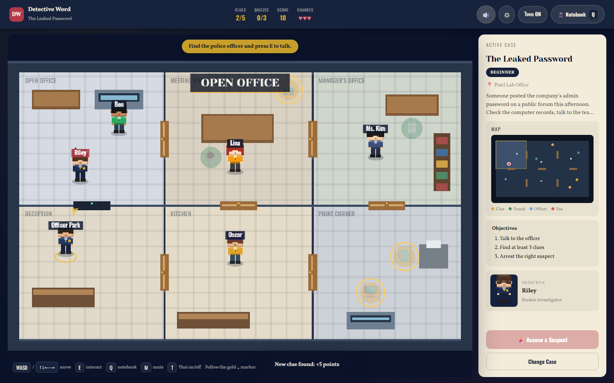

# Detective Word 2D

เกมนักสืบ 2D บนเว็บสำหรับฝึกภาษาอังกฤษ ผู้เล่นเดินสำรวจสถานที่เกิดเหตุ คุยกับพยาน อ่านหลักฐานภาษาอังกฤษ ตอบคำถามคำศัพท์และ tense แล้ว **"จับโกหก"** โดยเลือกผู้ต้องสงสัย ประโยคที่เป็นเท็จ และหลักฐานที่พิสูจน์ได้

คลิกคำที่ขีดเส้นใต้เพื่อดูความหมายภาษาไทยได้ทันที และทุกบรรทัดมีซับไตเติลไทยที่เปิด/ปิดได้



> เอกสารออกแบบฉบับเต็ม (กลไก คะแนน เนื้อหาทุกคดี สถาปัตยกรรม): **[GDD.md](GDD.md)**

---

## ฟีเจอร์

- **10 คดี 3 หมวด:** 🕵️ Detective English (4 คดี) · 💻 IT English (3 คดี) · 💼 Workplace English (3 คดี) ระดับ Beginner → Advanced
- **Catch the Lie:** กล่าวหาด้วยการเลือก ผู้ต้องสงสัย + ประโยคเท็จ + หลักฐาน มีโอกาสผิด 3 ครั้ง
- **ดิกชันนารีในเกม:** 405 คำ/วลี + 41 กริยาอปกติ จับรูปผันได้ (logged → log, went → go, checked in → check in) พร้อมตารางกริยาช่อง 1/2/3 และคำอธิบายภาษาไทย
- **Word Report หลังจบคดี:** สรุปคำศัพท์ภาษาอังกฤษทุกคำที่ผู้เล่นได้อ่านในคดีนั้น พร้อมชนิดคำ คำแปลไทย รูปที่เจอจริง (เช่น read as "logged") คำที่กดดูความหมายจะขึ้นก่อนพร้อม 🔍 และสรุปผลคำถามภาษาอังกฤษแต่ละข้อ แสดงทันทีข้างผลคดีในหน้า CASE SOLVED / CASE CLOSED (ไม่ต้องกดปุ่ม) และเปิดซ้ำได้จาก Notebook หลังจบคดี
- **ซับไตเติลไทย** ทุกบทพูด หลักฐาน คำถาม และเฉลย กด `T` เพื่อซ่อน
- **ดาว ★★★ ต่อคดี:** ไขคดีได้ · ไม่กล่าวหาผิด · ตอบคำถามถูกทุกข้อโดยไม่ใช้ hint
- **ระบบนำทาง:** objective tip, วงแหวนทองชี้เป้าหมาย, ลูกศร, minimap, ประตูเปิดอัตโนมัติ, ระบบไถลมุมกันติดผนัง
- **ไม่มีไฟล์ภาพหรือเสียงเลย:** ตัวละคร chibi pixel วาดด้วยโค้ด ดนตรีแจ๊สและเสียงประกอบสังเคราะห์ด้วย Web Audio API (ใส่ไฟล์เสียงจริงแทนได้)
- **พร้อมใช้ในห้องเรียน:** ไม่ต้องล็อกอิน ไม่บันทึกข้อมูลผู้เล่นลงเครื่อง รีเฟรช = ผู้เล่นใหม่, เซิร์ฟเวอร์ปิดแคชเสมอ, WASD ใช้ได้แม้คีย์บอร์ดเป็นภาษาไทย

---

## เริ่มต้นใช้งาน

### สิ่งที่ต้องมี

- Python 3.10 ขึ้นไป (โปรเจกต์ทดสอบกับ 3.13)
- เบราว์เซอร์สมัยใหม่ (Chrome, Edge, Firefox)

### ติดตั้งและรัน

```bash
# 1. สร้างและเปิด virtual environment
python -m venv .venv
# Windows
.venv\Scripts\activate
# macOS / Linux
source .venv/bin/activate

# 2. ติดตั้ง Flask
pip install -r requirements.txt

# 3. รันเซิร์ฟเวอร์
python app.py
```

เปิด **http://127.0.0.1:5000** ในเบราว์เซอร์

> เซิร์ฟเวอร์มีหน้าที่ส่งไฟล์เท่านั้น ตัวเกมทั้งหมดทำงานในเบราว์เซอร์ ไม่มีขั้นตอน build

---

## วิธีเล่น

| ปุ่ม | การทำงาน |
|---|---|
| `W A S D` / `↑ ↓ ← →` | เดิน |
| `E` | คุยกับคน / ตรวจหลักฐาน |
| `Q` | เปิดสมุดบันทึก (Notebook) |
| `T` | ซับไตเติลไทย เปิด/ปิด |
| `M` | ปิด/เปิดเสียง |
| `Esc` | ปิดหน้าต่าง |
| คลิกคำที่ขีดเส้นใต้ | ดูความหมายภาษาไทยและประโยคตัวอย่าง |

บนจอเล็กจะมีปุ่มทิศทางและปุ่ม E แบบสัมผัส

**ขั้นตอนในแต่ละคดี**

1. คุยกับตำรวจ (ตามวงแหวนสีทอง)
2. สำรวจห้อง เก็บหลักฐานให้ครบขั้นต่ำ (3 หรือ 4 ชิ้น) และตอบคำถามภาษาอังกฤษ
3. เทียบคำให้การของผู้ต้องสงสัยกับเวลาและสถานที่ในหลักฐาน
4. กด **🚨 Accuse a Suspect** แล้วเลือก ใคร → ประโยคไหนเป็นเท็จ → หลักฐานอะไรพิสูจน์

> เคล็ดลับ: ตอบคำถามภาษาอังกฤษให้ครบ **ก่อน** กล่าวหา ดาวดวงที่ 3 นับตอนไขคดีสำเร็จ

### คะแนน

| เหตุการณ์ | คะแนน |
|---|---|
| เจอหลักฐานใหม่ | +5 |
| ตอบถูก | +20 (+5/+10/+15 เมื่อถูกติดกัน) |
| ตอบผิด | −5 |
| ใช้ hint | −3 |
| ไขคดีสำเร็จ | +50 |
| กล่าวหาผิด | −10 และเสีย 1 โอกาส |

---

## รายชื่อคดี

| # | คดี | หมวด | ระดับ | สถานที่ |
|---|---|---|---|---|
| 1 | The Missing Laptop | Detective | Beginner | Narin School |
| 2 | The Vanishing Sculpture | Detective | Intermediate | Bayview Museum |
| 3 | The Stolen Suitcase | Detective | Intermediate | Riverside Station |
| 4 | The Empty Tank | Detective | Advanced | Coral Bay Aquarium |
| 5 | The Leaked Password | IT | Beginner | Pixel Lab Office |
| 6 | The Deleted Database | IT | Intermediate | Cloudline Data Center |
| 7 | The Hacked Website | IT | Advanced | Brightwave Online Shop |
| 8 | The Missing Contract | Workplace | Beginner | Harbor & Co. Office |
| 9 | The Night Shift | Workplace | Intermediate | Grand Palm Hotel |
| 10 | The Office Party | Workplace | Advanced | Summit Tower, 12th Floor |

---

## โครงสร้างโปรเจกต์

```
Detective Word 2D/
├── app.py                  Flask server: ส่ง index.html + /static, ปิดแคชเบราว์เซอร์
├── requirements.txt        Flask==3.1.1
├── package.json            สคริปต์ Node สำหรับ validator และเทสต์ (ไม่บังคับ)
├── templates/
│   └── index.html          หน้าเดียวของเกม: ทุกหน้าจอ + ลำดับโหลดสคริปต์
├── static/
│   ├── css/game.css        สไตล์ทั้งหมด (สี token อยู่ใน :root)
│   ├── audio/              ไฟล์เสียงจริง (ไม่บังคับ) + manifest.json
│   └── js/
│       ├── engine/         ชิ้นส่วนใช้ซ้ำ ไม่รู้จักคดีใด ๆ
│       │   ├── mapkit.js       gridMap(): สร้างห้อง ผนัง ประตูจากตาราง
│       │   ├── sprites.js      วาดตัวละคร chibi ด้วยโค้ด
│       │   └── sound.js        synth, ดนตรีแจ๊ส procedural, ambience
│       ├── data/           เนื้อหาล้วน: แก้ที่นี่เพื่อเพิ่มเนื้อหา
│       │   ├── cases-detective.js / cases-it.js / cases-work.js
│       │   ├── vocab.js            ดิกชันนารี + กริยาอปกติ
│       │   ├── thai-dialogue.js    ซับไทยของบทพูด NPC
│       │   ├── thai-content.js     ซับไทยของหลักฐาน คำถาม คำสารภาพ เฉลย
│       │   ├── briefing.js         บทพูดของ Chief Rowan
│       │   └── characters.js       ตัวละครผู้เล่น + ชุดตำรวจ
│       └── game/           ตัวเกม (แต่ละไฟล์ใช้ของไฟล์ที่โหลดก่อน)
│           core.js · dictionary.js · audio.js · progress.js · thai.js
│           modals.js · accusation.js · wordreport.js · screens.js · case.js · world.js
│           render.js · input.js · debug.js · main.js
├── tools/                  validator ข้อมูล (Python และ Node ใช้กฎชุดเดียวกัน)
└── tests/                  เทสต์เบราว์เซอร์, jsdom, ประตู + screenshots
```

สคริปต์เป็น `<script>` ธรรมดาที่แชร์ชื่อ global กัน **ลำดับใน `index.html` สำคัญ:** engine → data → game และ `main.js` ต้องอยู่สุดท้าย

---

## Adding a case

ทุกคดีอยู่ในไฟล์ `static/js/data/cases-*.js` และมีรูปแบบเดียวกัน วิธีที่ง่ายที่สุดคือคัดลอกคดีที่มีอยู่แล้วแก้

### 1. สร้างแผนที่

```js
const mapX = M.gridMap({
  id: "my-map", name: "My Place",          // id ห้ามซ้ำกับแผนที่อื่น
  cols: [300, 306, 306], rows: [246, 306], // ผลรวม 912 × 552 = พอดี canvas 960×600
  cells: [
    [{ label: "ROOM A", floor: "#d8d1c3" }, { label: "ROOM B", floor: "#d8caa8" }, null],  // null = ไม่มีห้อง
    [{ label: "ROOM C", floor: "#c9d8c2" }, { label: "ROOM D", floor: "#c8ced8" }, { label: "ROOM E", floor: "#cfc6b6" }]
  ],
  furniture: [
    { x: 60, y: 90, w: 110, h: 44, kind: "desk" }
    // kind: desk, counter, shelf, bench, gym_bench, locker, crate, computer, printer, server
  ]
});
```

`gridMap()` สร้างผนังรอบนอกและประตูกลางผนังระหว่างห้องที่ติดกันให้อัตโนมัติ ทุกห้องจึงเข้าถึงได้เสมอ **อย่าวางเฟอร์นิเจอร์ขวางประตู**

### 2. เขียนคดี

```js
const caseX = {
  id: "my-case", title: "The Something", difficulty: "Beginner",  // Beginner | Intermediate | Advanced
  category: "detective",          // detective | it | work
  scene: "school",                // school | museum | station | aquarium (ธีมเพลง + เสียงบรรยากาศ)
  location: "My Place", map: mapX,
  description: "What happened, and how many clues to find.",
  playerStart: { x: 130, y: 220 },
  minimumClues: 3,
  officerId: "officer",           // id ของ NPC ตำรวจ
  culpritId: "bob",               // id ของคนร้าย (role ต้องเป็น "Suspect")
  proofId: "camera",              // หลักฐานหลัก ต้องอยู่ใน contradictions
  contradictions: { 0: ["camera"] },   // index ประโยคเท็จของคนร้าย → id หลักฐานที่หักล้าง
  confession: "Okay… I did it, because …",    // อย่างน้อย 6 คำ
  solution: "Bob said …, but the camera shows …",
  npcs: [
    { id: "officer", name: "Officer Someone", role: "Police Officer", x: 220, y: 165, look: POLICE.officerA,
      lines: ["What happened.", "Where to look.", "How many clues to find."] },
    { id: "bob", name: "Bob", role: "Suspect", x: 760, y: 380, look: LOOK.capKid,
      lines: ["A false statement.", "Another statement."] }
    // + พยาน 1 คน และผู้ต้องสงสัยอย่างน้อย 2 คนรวมคนร้าย
  ],
  clues: [
    { id: "camera", name: "Security Camera", icon: "📹", x: 900, y: 460,
      text: "Footage shows Bob entering the room at 4:15 p.m.", question: "q1" }
  ],
  questions: [
    { id: "q1", topic: "vocab",   // vocab | it | work | tense
      term: "entering",           // คำที่ทดสอบ ต้องอยู่ใน prompt และจะไม่ถูกขีดเส้นใต้ในข้อนี้
      prompt: "The camera shows Bob 'entering' the room. What does entering mean?",
      choices: ["Going into a place", "Leaving a place", "Cleaning a place", "Locking a place"],
      correct: 0,                 // เขียนข้อถูกไว้ข้อแรก เกมสุ่มลำดับบนจอให้เอง
      hint: "Enter and exit are opposites.",
      explain: "Entering means going into a place." }
  ]
};
```

แล้วเพิ่มเข้า `window.DW_CASES.push(...)` ท้ายไฟล์

**กฎที่ต้องทำตาม** (validator ตรวจให้):
- ทุกคำถามต้องผูกกับหลักฐาน 1 ชิ้น มิฉะนั้นจะได้ ★★★ ไม่ได้
- ชื่อและรูปลักษณ์ (`look`) ของ NPC ห้ามซ้ำกับคดีอื่น
- NPC และหลักฐานต้องอยู่ในห้อง ไม่ทับผนังหรือเฟอร์นิเจอร์ และเดินไปถึงได้จาก `playerStart`

### 3. เพิ่มคำแปลไทย

- **บทพูด** → `data/thai-dialogue.js`: `"my-case": { officer: ["…", "…", "…"], bob: ["…", "…"] }` (index ตรงกับ `lines`)
- **ที่เหลือ** → `data/thai-content.js`:

```js
"my-case": {
  clues: { camera: "…" },
  questions: { q1: { prompt: "…", choices: ["…", "…", "…", "…"], explain: "…", hint: "…" } },  // choices ตามลำดับในไฟล์คดี
  confession: "…",
  solution: "…"
}
```

### 4. เพิ่มคำศัพท์ (ถ้ามีคำใหม่)

ใน `data/vocab.js` เก็บ **รูปพื้นฐานตัวพิมพ์เล็ก** เท่านั้น:

```js
"enter": ["v.", "เข้า", "Please enter the room quietly."],
```

- ไม่ต้องเพิ่ม `entered`, `entering`, `enters` เพราะเกมจับรูปผันปกติให้เอง (validator จะเตือนถ้าเพิ่ม)
- กริยาอปกติให้เพิ่มรูปช่อง 2 / 3 ใน `DW_IRREGULAR` และต้องมีรูปช่อง 1 ใน `DW_VOCAB` ด้วย
- วลีได้สูงสุด 3 คำ (เช่น `"out of office"`)

### 5. ตรวจข้อมูล

```bash
python tools/validate_data.py
```

ต้องเห็น `All data validation checks passed`

---

## การตรวจสอบและเทสต์

### ตัวตรวจข้อมูล (แนะนำ ไม่ต้องใช้ Node)

```bash
pip install playwright
playwright install chromium
python tools/validate_data.py
```

ตรวจ schema ทุกคดี, ID ซ้ำ, ห้องเข้าถึงได้ครบ, วัตถุเดินถึงได้, เฟอร์นิเจอร์ไม่บังประตู, ซับไทยครบ, คำถามและ contradictions ถูกต้อง, คีย์ซ้ำในดิกชันนารี

### เทสต์เล่นจริงในเบราว์เซอร์

```bash
python app.py                          # เทอร์มินัลที่ 1
python tests/browser_smoke_test.py     # เทอร์มินัลที่ 2
```

### เทสต์ Node (ไม่บังคับ)

```bash
npm install
npm test        # validate + door walk test + jsdom DOM test
```

| คำสั่ง | ทำอะไร |
|---|---|
| `npm run validate` | ตัวตรวจข้อมูลเวอร์ชัน Node |
| `npm run test:doors` | เดินผ่านทุกประตูทุกคดีจาก 9 จุดเริ่ม ต้องไม่ติด |
| `npm run test:dom` | การพิมพ์ไม่ขยับตัวละคร, เพลงหยุดเมื่อออกคดี, การสุ่ม, ซับไทย, การกล่าวหา |

Hooks สำหรับเทสต์อยู่ที่ `window.__DETECTIVE_DEBUG__` (`static/js/game/debug.js`)

---

## เสียง

เกมมีเสียงครบโดยไม่ต้องมีไฟล์: ธีมแจ๊สต่อสถานที่ 4 ธีม, เพลงตึงเครียดตอนกล่าวหา, เสียงบรรยากาศ และเสียงประกอบทั้งหมด ปรับระดับได้ที่ปุ่ม ⚙ (master / music / sfx / ambience)

ถ้าต้องการเสียงจริง ให้วางไฟล์ `.ogg` / `.mp3` ใน `static/audio/` แล้วลงชื่อใน `static/audio/manifest.json` ดูรายชื่อคีย์และแหล่งไฟล์ที่ใช้ได้ฟรีใน [static/audio/README.md](static/audio/README.md)

---

## ข้อมูลที่บันทึก

| ข้อมูล | เก็บที่ |
|---|---|
| ชื่อ, ความคืบหน้า, สถิติดีที่สุด, สถานะซับไทย | หน่วยความจำเท่านั้น (หายเมื่อรีเฟรช) |
| การตั้งค่าเสียง | `localStorage` ของเบราว์เซอร์ |

ออกแบบให้เครื่องในห้องเรียนใช้ร่วมกันได้: **รีเฟรชหน้า = ผู้เล่นคนใหม่**

---

## Deploy

`app.py` เป็นแอป Flask ธรรมดา deploy บนโฮสต์ที่รัน Python ได้ทุกที่ (เช่น Render, Railway, PythonAnywhere หรือ `gunicorn app:app`)

> หมายเหตุ: คอมเมนต์ใน `app.py` อ้างถึง `vercel.json` สำหรับ deploy บน Vercel แต่ไฟล์นี้ยังไม่มีในโปรเจกต์ ต้องสร้างเองถ้าจะใช้ Vercel

---

## เทคโนโลยี

- **Backend:** Python, Flask 3.1.1
- **Frontend:** HTML, CSS, JavaScript ล้วน (ไม่มี framework, ไม่มี build step)
- **กราฟิก:** Canvas 2D
- **เสียง:** Web Audio API
- **ฟอนต์:** Yeseva One, Vollkorn, Oswald, Taviraj (Google Fonts)
- **เทสต์:** Playwright (Python), jsdom (Node)
